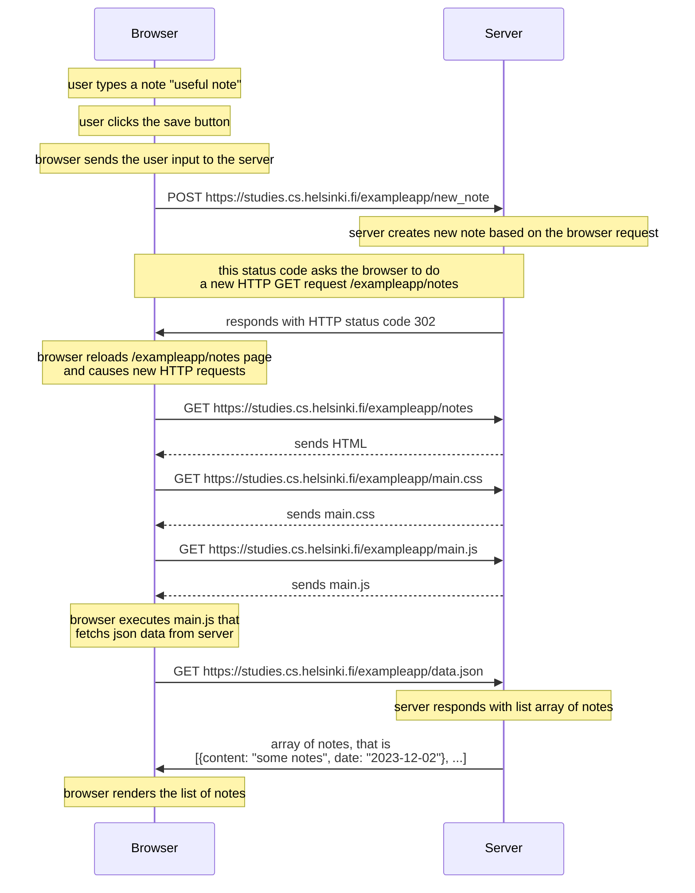

```mermaid
sequenceDiagram
participant B as Browser
participant S as Server
Note over B: user types a note "useful note"
Note over B: user clicks the save button
Note over B: browser sends the user input to the server
B ->> S: POST https://studies.cs.helsinki.fi/exampleapp/new_note
Note over S: server creates new note based on the browser request
Note over B, S: this status code asks the browser to do <br /> a new HTTP GET request /exampleapp/notes
S ->> B: responds with HTTP status code 302
Note over B: browser reloads /exampleapp/notes page<br />and causes new HTTP requests
B ->> S: GET https://studies.cs.helsinki.fi/exampleapp/notes
S -->> B: sends HTML
B ->> S: GET https://studies.cs.helsinki.fi/exampleapp/main.css
S -->> B: sends main.css
B ->> S: GET https://studies.cs.helsinki.fi/exampleapp/main.js
S -->> B: sends main.js
Note over B: browser executes main.js that <br /> fetchs json data from server
B ->> S: GET https://studies.cs.helsinki.fi/exampleapp/data.json
Note over S: server responds with list array of notes
S ->> B: array of notes, that is <br /> [{content: "some notes", date: "2023-12-02"}, ...]
Note over B: browser renders the list of notes
```
