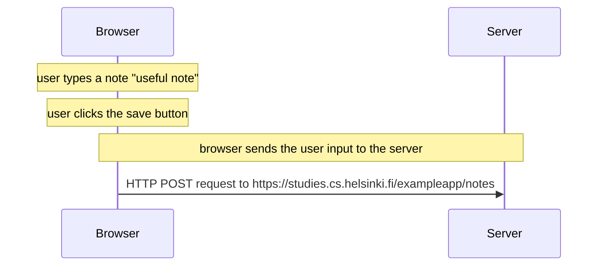

```mermaid
sequenceDiagram
participant B as Browser
participant S as Server
Note over B: user types a note "useful note"
Note over B: user clicks the save button
Note over B, S: browser sends the user input to the server
B ->> S: HTTP POST request to https://studies.cs.helsinki.fi/exampleapp/notes
```
