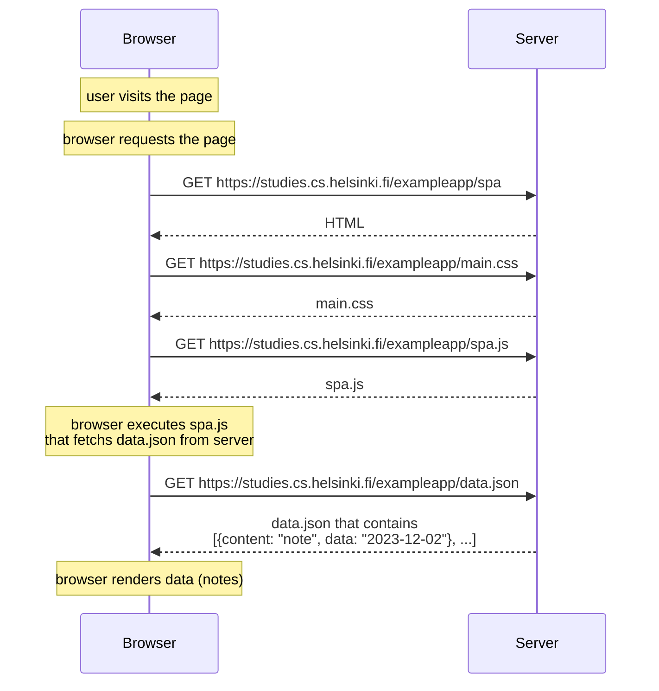

```mermaid
sequenceDiagram
participant B as Browser
participant S as Server
Note over B: user visits the page
Note over B: browser requests the page
B ->> S: GET https://studies.cs.helsinki.fi/exampleapp/spa
S -->> B: HTML
B ->> S: GET https://studies.cs.helsinki.fi/exampleapp/main.css
S -->> B: main.css
B ->> S: GET https://studies.cs.helsinki.fi/exampleapp/spa.js
S -->> B: spa.js
Note over B: browser executes spa.js <br />that fetchs data.json from server
B ->> S: GET https://studies.cs.helsinki.fi/exampleapp/data.json
S -->> B: data.json that contains <br /> [{content: "note", data: "2023-12-02"}, ...]
Note over B: browser renders data (notes)
```
