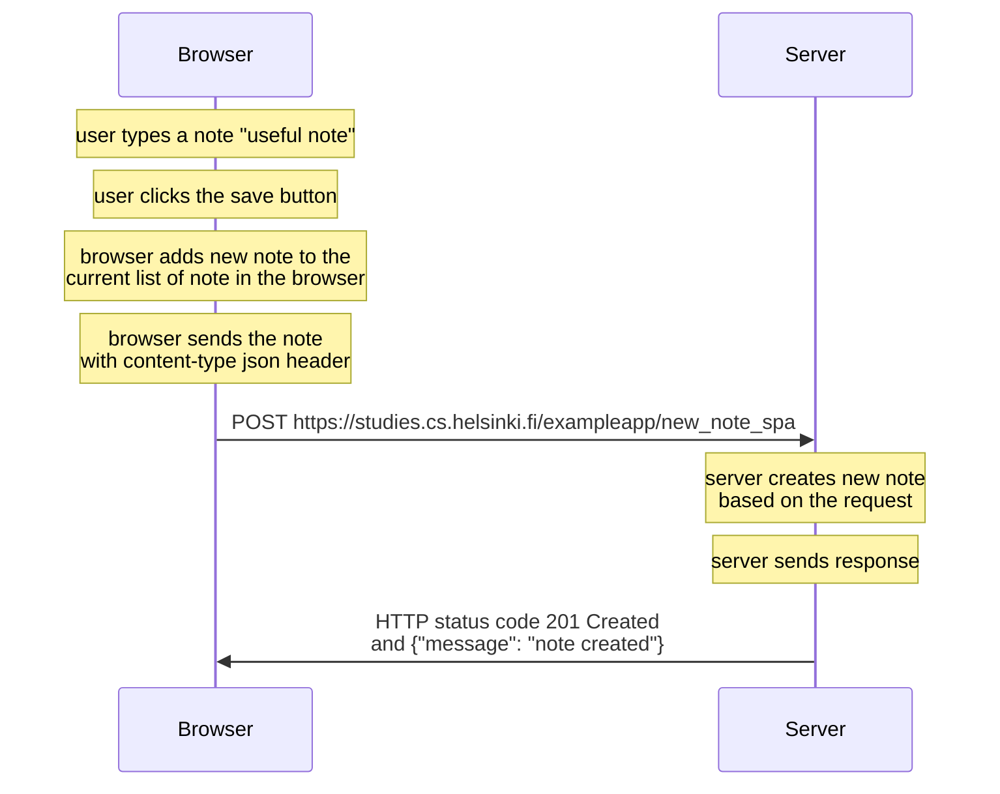

```mermaid
sequenceDiagram
participant B as Browser
participant S as Server
Note over B: user types a note "useful note"
Note over B: user clicks the save button
Note over B: browser adds new note to the <br>current list of note in the browser
Note over B: browser sends the note <br> with content-type json header
B ->> S: POST https://studies.cs.helsinki.fi/exampleapp/new_note_spa
Note over S: server creates new note<br>based on the request
Note over S: server sends response
S ->> B: HTTP status code 201 Created <br> and {"message": "note created"}

```
